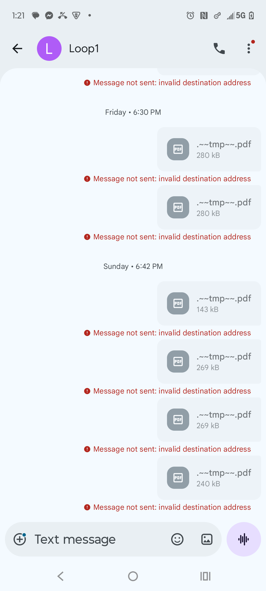
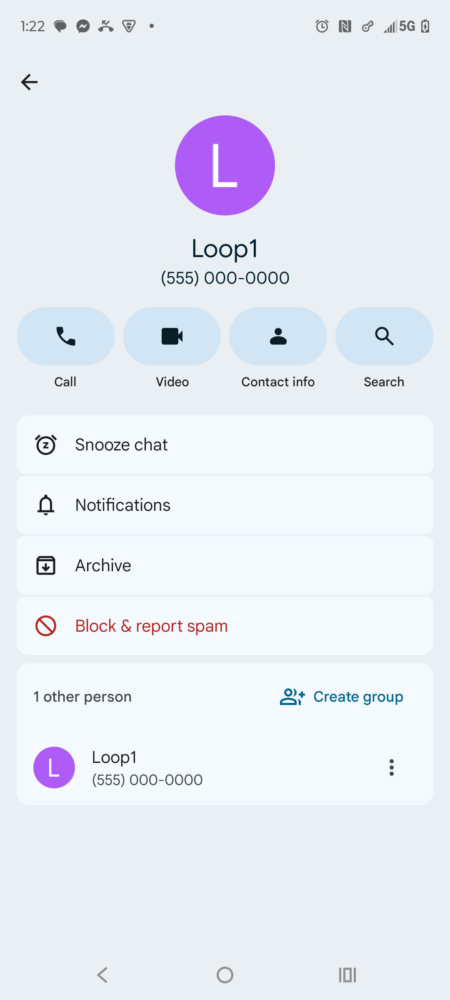

# Loop1 Hand Over Point (HOP) - Autel PDF Export Workflow

**Last Updated**: 2026-06-23
**Purpose**: Document the Loop1 contact workaround for extracting Autel diagnostic PDFs

---

## Overview

**Loop1** is a fake contact used as a "Hand Over Point" (HOP) to export Autel MaxiAP200 diagnostic reports as PDFs without actually sending them via MMS.

## How It Works

1. **Autel App**: Generate diagnostic report (DTC scan, live data, etc.)
2. **Share**: Use Autel's "Share" feature
3. **Select Loop1 Contact**: Choose the Loop1 contact (555-000-0000)
4. **Fail to Send**: Message fails with "Invalid destination address"
5. **PDFs Land in Downloads**: Attachments are saved to `/sdcard/Download/`

## Loop1 Contact Details

- **Name**: Loop1
- **Number**: (555) 000-0000
- **Purpose**: Fake destination that causes MMS to fail but keeps attachments
- **Message App**: Google Messages (com.google.android.apps.messaging)

## PDF Locations

### Where Autel PDFs End Up

**Path**: `/sdcard/Download/`

**Naming Pattern**: `_.~~tmp~~ (2) (N).pdf` where N increments

**Example Files**:
```
-rw-rw---- 1 u0_a395 media_rw 327K 2026-06-09 18:23 _.~~tmp~~ (2) (26).pdf
-rw-rw---- 1 u0_a395 media_rw 267K 2026-06-06 18:39 _.~~tmp~~ (2) (23).pdf
-rw-rw---- 1 u0_a395 media_rw 143K 2026-05-31 20:44 _.~~tmp~~ (2) (16).pdf
```

**Also Sometimes**:
```
Mercedes_DTC_Report.pdf
Mercedes_DTC_Report-1.pdf
```

### Accessing via ADB

```bash
adb shell 'ls -lh /sdcard/Download/*.pdf'
```

### Accessing from Termux (Android 15 Issue)

**Problem**: Android 15 scoped storage blocks Termux from accessing `/sdcard/Download/` even with storage permission granted.

```bash
# In Termux - FAILS on Android 15
cd ~/storage/downloads/
ls *.pdf
# Permission denied
```

**Workaround Options**:

1. **Root**: Use root access to bypass scoped storage
2. **ADB Pull**: Copy files via ADB to accessible location
3. **Patch Termux**: Modify Termux to request broader storage permissions
4. **Patch Google Messages**: Modify messaging app to save to Termux-accessible path

## Workflow: Getting PDFs to Claude Code in Termux

### Current Method (ADB-based)

```bash
# 1. Copy PDFs from Downloads to Termux's external storage
adb shell 'mkdir -p /sdcard/Android/data/com.termux/files/autel_pdfs'
adb shell 'cp /sdcard/Download/_.~~tmp~~*.pdf /sdcard/Android/data/com.termux/files/autel_pdfs/'

# 2. Access from Termux
# (Still blocked by Android 15 - needs patching)
```

### Future Method (Patched App)

**Option A: Patch Termux**
- Add `MANAGE_EXTERNAL_STORAGE` permission request
- Grants access to all `/sdcard/` paths
- Requires recompiling Termux APK

**Option B: Patch Google Messages**
- Modify default attachment save location
- Change from `/sdcard/Download/` to `/sdcard/Android/data/com.termux/files/`
- Requires decompiling and repackaging Messages app

**Option C: Create Bridge App**
- Small app with storage permissions
- Monitors `/sdcard/Download/` for new PDFs
- Copies them to Termux-accessible location automatically
- Can run as background service

## Screenshots

**Loop1 Conversation**:


**Loop1 Contact Info**:


## Why This Matters

The Loop1 HOP enables:

1. **Automated PDF Export**: No manual "save as" needed
2. **Consistent File Location**: All PDFs go to same place
3. **Timestamp Preservation**: File modification time = when report was shared
4. **No Internet Required**: Doesn't try to send via actual MMS server
5. **Works Offline**: Airplane mode friendly

## Analysis Workflow (Once Access is Fixed)

```bash
# In Termux
cd ~/autel_pdfs/

# Launch Claude Code
claude

# Analyze latest PDF
cat "What DTCs are in the latest PDF report?"

# Batch analyze all reports
cat "Compare all PDF reports and show trends in diagnostic trouble codes over time"

# Extract data
cat "Parse all PDFs and create a CSV with: date, vehicle, DTCs found, severity"
```

## Related Documentation

- **[CLAUDE_CODE_TERMUX_INSTALL.md](CLAUDE_CODE_TERMUX_INSTALL.md)** - Installing Claude Code in Termux
- **[README.md](README.md)** - Autel data locations and ADB access
- **[WORKFLOW.md](WORKFLOW.md)** - Daily diagnostic analysis workflow

---

## TODO: Enable Full Workflow

- [ ] Choose patching approach (Termux vs Messages vs Bridge App)
- [ ] Implement selected solution
- [ ] Test PDF access from Termux
- [ ] Verify Claude Code can read and analyze PDFs
- [ ] Document final working procedure
- [ ] Automate: New Autel report → Loop1 → Auto-copy → Claude analysis

---

**Discovered**: 2026-06-23
**Status**: Documented, awaiting scoped storage workaround implementation
